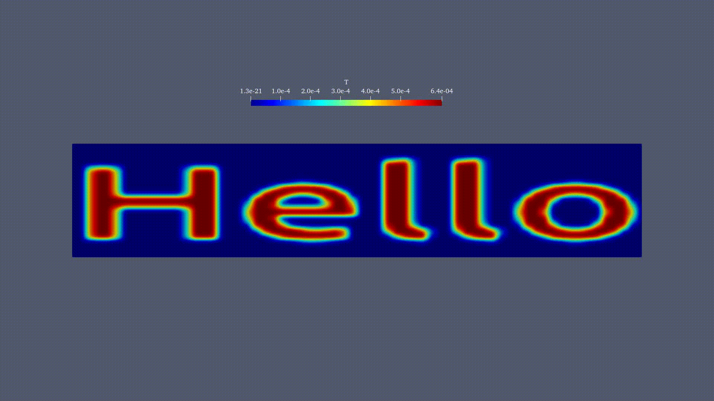
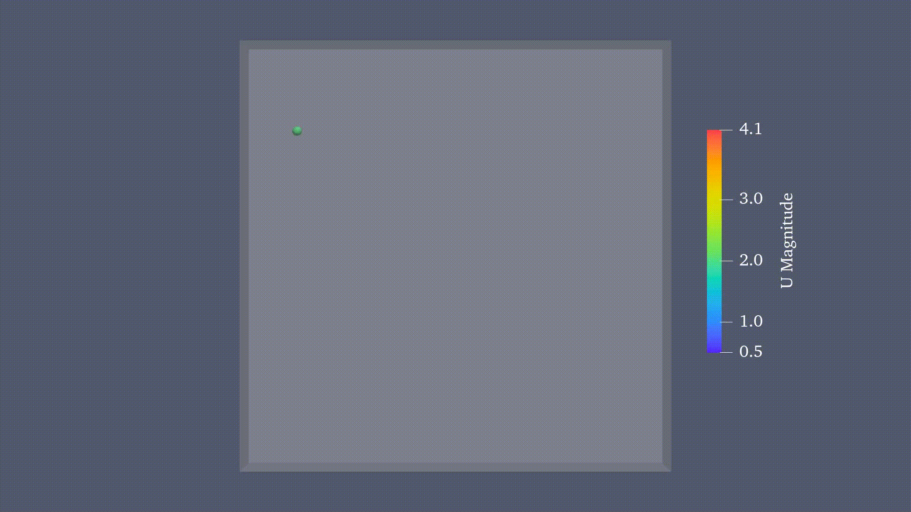
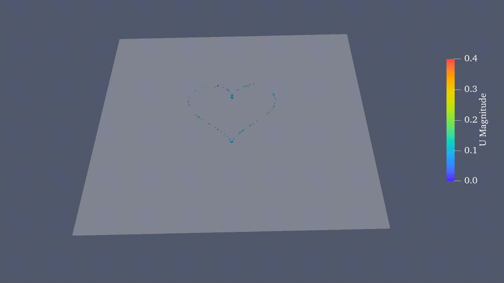

# Foam4Fun - CFD Visualization Projects

A collection of innovative C++ projects that combine computational fluid dynamics (CFD) with creative visualization techniques using OpenFOAM.

## 🎯 Overview

**Foam4Fun** is a repository of experimental CFD applications that push the boundaries of OpenFOAM integration with modern C++ and graphical rendering. Each project demonstrates unique approaches to solving and visualizing fluid dynamics problems.

## 📁 Projects

### [TextDiffusion](./src/TextDiffusion/)

**Text-to-CFD Visualization** - Renders text using TrueType fonts and simulates diffusion patterns.

- **Renders text** from TrueType font files into a 2D bitmap matrix
- **Maps the bitmap** to a computational mesh grid
- **Initializes a temperature field** based on the text pattern
- **Simulates diffusion** to create an animated text evolution

### [BouncingBall](./src/BouncingBall/)

**CFD Simulation of a Bouncing Ball** - Simulates the fluid dynamics around a bouncing ball using OpenFOAM.
- **Sets up a computational mesh** around the ball
- **Applies boundary conditions** to simulate bouncing motion
- **Visualizes the flow field** around the ball during its motion

### [HeartFountain](./src/HeartFountain/)
**Heart-Shaped Particle Fountain** - Injects particles along a heart-shaped curve to create a fountain-like Lagrangian visualization.
- **Custom injector model** built as a user library
- **Heart-shaped injector layout** generated by a Python script
- **Time-varying injection speed** using sine coefficients
- **Particle-cloud / flow coupling** through source terms in the momentum equation

## 📄 License

MIT License - See individual project headers for details.

## 🤝 Contributing

This is a personal experimental repository. Feel free to fork and extend with your own CFD projects!
